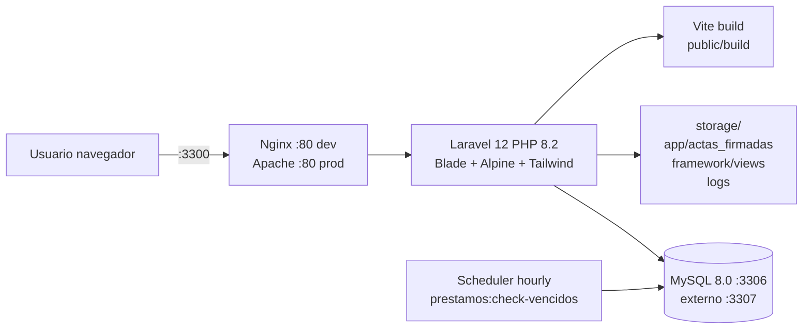
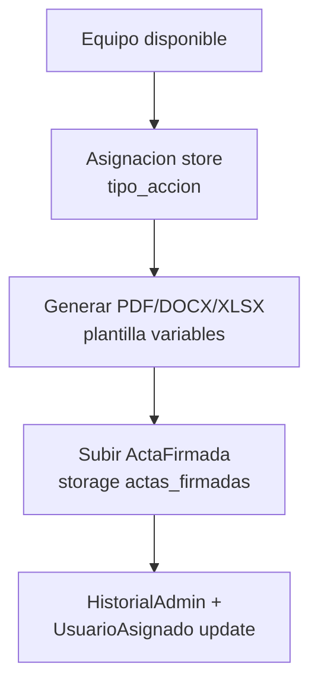
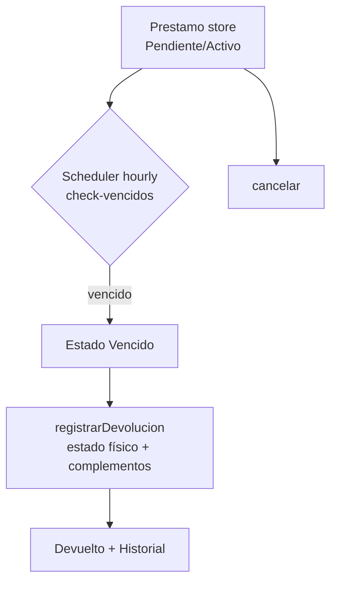
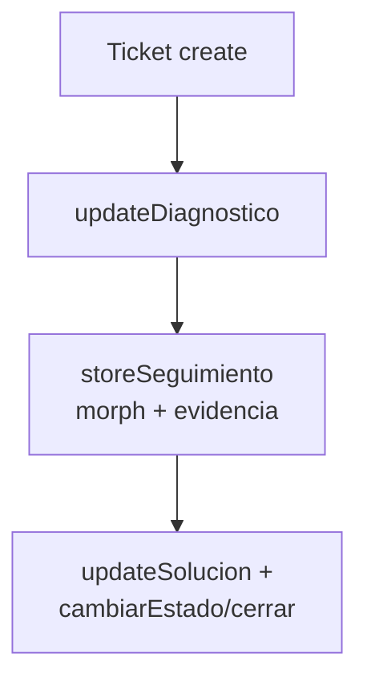
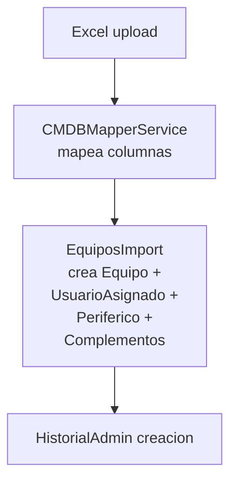

# Contexto del Proyecto — Inventario FNC

> **Archivo de contexto para desarrolladores e IAs.** Generado: 2026-10-01
> Proyecto: `inventario-fnc` — Sistema de Inventario / CMDB + HelpDesk + Gestión de activos TI
> Organización: Federación Nacional de Cafeteros de Colombia (FNC)
> App: `Inventario de Equipos` | Locale `es` | Timezone `America/Bogota`

---

## 1. Visión general

Sistema monolítico **Laravel SSR (Blade)** para gestionar el ciclo de vida de equipos de cómputo y activos TI:

- **CMDB:** registro de equipos (serial, placa, activo fijo, specs), tipos de recurso, complementos, periféricos, campos personalizados, importación/exportación Excel masiva.
- **Custodia:** asignaciones (asignación/reemplazo/retiro/mantenimiento/baja/restauración) con actas PDF/DOCX/XLSX firmables, asignación bajo responsabilidad, autorizaciones de activos, préstamos con vencimientos.
- **Operación:** mesa de ayuda (tickets + diagnósticos + seguimientos + evidencias), historiales técnico/administrativo/complementos, checklists, garantías, mantenimientos.
- **Licenciamiento:** módulo unificado de licencias (seriales, asignaciones a equipo/funcionario, historial, reportes). Legacy `suscripciones`/`vitalicias` redirigen a `/licencias`.
- **Admin:** usuarios, roles/permisos, auditoría, plantillas PDF con variables, plantillas de exportación, campos personalizados, solicitudes públicas de cambio de contraseña, cambio obligatorio al primer login.

No hay API REST (`routes/api.php` no existe). Todo es web Blade + validación con `FormRequest` + permisos Spatie por ruta.

---

## 2. Stack tecnológico

| Capa | Tecnología | Versión / detalle |
|---|---|---|
| Backend | PHP | `^8.2` |
| Framework | Laravel | `^12.0` |
| Auth scaffold | laravel/breeze | `^2.4` |
| Roles/permisos | spatie/laravel-permission | `^6.25` |
| Excel import/export | maatwebsite/excel + phpoffice/phpspreadsheet | `^3.1` / `^1.30` |
| PDF | barryvdh/laravel-dompdf | `^3.1` |
| Frontend SSR | Blade (~100+ vistas) | `resources/views/` |
| CSS | Tailwind `^3.1` + `@tailwindcss/forms` + `autoprefixer` + `postcss` | tokens propios en `resources/css/global/app.css` (`--primary #9e052b` FNC, sidebar 260px) |
| JS | Alpine.js `^3.4`, Axios `^1.11`, Vanilla JS | `resources/js/app.js` + `bootstrap.js` + `login/solicitud-cambio-password.js` |
| UI kit | Bootstrap `^5.3.8` + bootstrap-icons `^1.13.1` vía CDN (`5.3.3`/`1.11.3` en layouts) | convive con Tailwind |
| Fuentes | Poppins (layout `inventario`), Figtree vía bunny.net (guest/app) | `tailwind.config.js` sans=Figtree |
| Build | Vite `^7` + laravel-vite-plugin `^2.0` | `vite.config.js` input: `app.css`, `dashboard.css`, `app.js` |
| BD | MySQL `8.0` (`utf8mb4_unicode_ci`, `sql_mode=""`) | 64 migraciones |
| Infra | Docker multi-stage (`composer:latest` + `php:8.2-apache`, OPcache+JIT, `a2enmod rewrite`) | `Dockerfile`, `docker-compose.yml` (dev), `docker-compose.prod.yml` (ZimaOS/CasaOS), `docker-compose.test.yml` |
| Testing backend | PHPUnit `^11` | `tests/Unit` (3) + `tests/Feature` (12 + 6 Auth) |
| Testing E2E | Playwright `@playwright/test ^1.62` | `tests/e2e/*.spec.js` (7 specs), baseURL `http://localhost:3300` |
| Calidad | Pint, Pail, Collision, Sail, PHPStan (`phpstan.neon`) | scripts composer |
| Colas/Cache/Sesión | `database` / `file` / `file` (dev); prod `file` | `QUEUE_CONNECTION=database` |
| Correo | `log` por defecto | `MAIL_MAILER=log` |

---

## 3. Arquitectura



- **Dev:** `docker compose up -d` → `app` (php-fpm, bind mount `.:/var/www` + hot reload), `webserver` (nginx:alpine `:3300→80`), `db` (mysql:8.0 `:3307→3306`).
- **Prod:** imagen `inventario_equipos:v1.0.0` (Apache, código copiado, sin bind mount salvo `/DATA/AppData/inventario/{storage,actas,mysql}`). `entrypoint.sh` idempotente: crea dirs, `chown www-data`, `storage:link --force`, `config:cache + route:cache + view:cache + event:cache`, `package:discover`, `migrate --force` solo si `RUN_MIGRATIONS=true`. Nunca hace `fresh/seed/clear`.
- `bootstrap/app.php` (estilo Laravel 11+): routing `web.php + console.php + /up`, aliases `prevent-back-history, force-password-change, role, permission, role_or_permission` (Spatie), global `CapitalizeFirstLetter`, `web.append TabContextMiddleware`, excepciones: Spatie `UnauthorizedException → errors.403`, `AuthenticationException` preserva `?_tab` al login.

---

## 4. Estructura de carpetas

```
app/
  Http/Controllers/ (42: 32 raíz + 10 Auth/) — Equipo, Asignacion, AsignacionResponsabilidad,
    Funcionario, Ticket, Prestamo, Licencia*, Suscripcion*, Vitalicia*, Historial*,
    ActaFirmada, TipoRecurso, ComplementoGlobal, CampoPersonalizado, PlantillaPdf,
    Reporte, Dashboard, Audit, User, Role, SolicitudCambioPassword, Checklist...
  Http/Requests/ — EquipoRequest, AsignacionRequest, ChecklistRequest, HistorialTecnicoRequest,
    Store/UpdateLicencia*, Store/UpdateCampoPersonalizado*, TipoRecursoRequest,
    SuscripcionRequest, VitaliciaRequest, Auth/LoginRequest, SolicitudCambioPassword/*
  Http/Middleware/ — PreventBackHistory, ForcePasswordChange, TabContextMiddleware,
    CapitalizeFirstLetter (+ Auth/TabSessionGuard)
  Models/ (37) — ver §6
  Services/ — PdfService, PdfCompressor, AsignacionService, DocumentGeneratorService,
    ConfiguracionActivosService, HistorialService, HistorialTecnicoService,
    Importadores/CMDBMapperService
  Exports/ — EquiposExport, LicenciasExport, ActivosPorFuncionarioExport,
    AsignacionesExport, MantenimientosExport, GarantiasExport + Providers/* (11 providers:
    General, DatosTecnicos, Responsable, Asignacion, Complementos, Perifericos,
    Historial, Licencias, Administrativo, CamposPersonalizados, AsignacionResponsabilidad)
  Imports/ — EquiposImport, EquiposImportSelector
  Observers/ — ActivoComplementoObserver
  Console/Commands/ — CheckPrestamosVencidos, SincronizarFuncionarios, AuditValidateCommand,
    ProfileLoadTimes, TestImportCommand
  Policies/ — SolicitudCambioPasswordPolicy
  Mail/ — SolicitudCambioPasswordCreadaMail
  Auth/ — TabSessionGuard (sesiones por pestaña ?_tab=)
  Providers/ — AppServiceProvider
  View/Components/ — AppLayout, GuestLayout
routes/
  web.php (430 líneas, todo auth+verified+prevent-back-history+force-password-change)
  auth.php (guest: register/login/solicitudes-cambio-password throttle 3,1/forgot/reset;
            auth: verify-email/confirm-password/password.update/logout)
  console.php (inspire + Schedule prestamos:check-vencidos hourly) — sin api.php
resources/views/ (~100 Blade)
  layouts/: app.blade.php (Breeze+Bootstrap CDN), inventario.blade.php (principal 696L: sidebar+Poppins),
            guest.blade.php (auth), navigation.blade.php
  components/: breeze (application-logo, dropdown, modal...) + ui/ (14: alert,badge,button,card,
              checkbox,filter-container,input,modal,select,table,textarea,toolbar)
  equipos/ (11: index,create,edit,show,importar,historial_vida,historial_complemento_*,
            _form,_complementos_show,partials/_modales_index)
  asignaciones/, complementos/, tipo_recursos/, funcionarios/, usuarios/, roles/,
  licencias/ + licencias_asignaciones/ + licencias_historial/, suscripciones/, vitalicias/,
  prestamos/, tickets/, checklists/ + _form, historial_tecnico/, campos_personalizados/,
  auditoria/, reportes/, solicitudes_password/, actas_firmadas/, pdf/ (acta_entrega*,
  estadisticas), plantillas_pdf/, emails/, errors/403.blade.php, dashboard.blade.php,
  auth/, profile/, vendor/pagination/ (9 variantes)
resources/js/: app.js (Alpine.start + capitaliza 1ª letra), bootstrap.js (axios),
               login/solicitud-cambio-password.js (toggle login vs solicitud)
resources/css/ (10 modulares vía app.css): global/app.css (1181L tokens), login, tickets,
  reportes, configuracion, equipos, usuarios, dashboard, solicitudes-password
config/: app,auth,cache,database,excel,filesystems,logging,mail,permission,queue,services,
         session,system (admin SYSTEM_ADMIN_* + force_password_change),debugbar
database/: migrations/ (64), seeders/ (DatabaseSeeder, RolesAndPermissionsSeeder,
           TipoRecursoSeeder, PermisosNuevosModulosSeeder stub), factories/ (UserFactory)
docker/: apache/000-default.conf, nginx/default.conf, entrypoint.sh (64L)
public/: index.php, branding/, imagenes/federacion cafeteros logo.png, build/ (manifest),
         storage link, scripts sueltos (check_db.php, info.php, generate_excel.php...)
tests/: Unit (3), Feature (12+6 Auth), e2e/ (7 specs + reports/)
e2e/example.spec.ts (plantilla Playwright legacy sin uso)
```

---

## 5. Módulos funcionales

| Módulo | Qué hace | Controlador | Rutas clave | Vistas |
|---|---|---|---|---|
| Dashboard | Pantalla `/inicio,/inicia,/dashboard` | DashboardController@index | `permission:dashboard.ver` | `dashboard.blade.php` |
| Equipos CMDB | CRUD + exportar/importar Excel + acta + historial vida + buscar por placa + autocomplete | EquipoController (index,searchAutocomplete,create/store,show/edit/update/destroy,exportar,importarForm/importar,historialVida,descargarActa,getComplementosPorTipo,store/update/destroy/transferirComplemento,buscarPorPlaca) | `/equipos/*`, `/equipos/exportar` throttle 10,1, `/equipos/importar` throttle 2,1 | `equipos/*` |
| Tipos Recurso | CRUD + catálogo complementos por tipo | TipoRecursoController | `tipo-recursos` resource + `catalogo-complementos.store/update` | `tipo_recursos/` |
| Complementos | Instancias por equipo (disponible/asignado/dañado/reparación/extraviado/baja), transferencia entre activos, global + historiales | EquipoController + ComplementoGlobalController + HistorialComplementoController | `/equipos/{equipo}/complementos*`, `/equipos/complementos-global`, `.../historial-global`, `.../{id}/historial` | `complementos/`, `equipos/historial_complemento_*` |
| Asignaciones | Asignación/reemplazo/retiro/mantenimiento/baja/restauración + PDF/DOCX/XLSX + funcionarios elegibles JSON | AsignacionController | `/asignaciones`, `porEquipo`, `funcionarios-elegibles`, `{asignacion}/pdf|docx|xlsx` | `asignaciones/` |
| Asign. Responsabilidad | Custodia temporal con fechas inicio/fin estimada/real, finalización y responsable | AsignacionResponsabilidadController (store,update,destroy) | `equipos/{equipo}/asignacion-responsabilidad` | parcial en `equipos/show` |
| Autorizaciones | Archivos por funcionario/equipo con ciclo cargada→consumida/anulada | FuncionarioController@storeAutorizacion/anular/descargar | `funcionarios/{f}/autorizaciones*` | `funcionarios/show` |
| Préstamos | CRUD + devolución + cancelación + chequeo vencidos horario | PrestamoController + `prestamos:check-vencidos` | `prestamos` resource (sin destroy) + `/{p}/devolver`, `/{p}/cancelar` | `prestamos/` |
| Funcionarios | CRUD (sin destroy) + datos encriptados | FuncionarioController | `funcionarios` only index/create/store/show + edit/update manual | `funcionarios/` |
| Tickets HelpDesk | CRUD + cambio estado + diagnóstico + seguimientos + solución + evidencias | TicketController | `tickets` resource + `/estado`, `/diagnostico`, `/seguimiento`, `/solucion`, `/evidencia*` | `tickets/` |
| Historiales | Técnico CRUD + porEquipo; Administrativo solo lectura; Complementos global/individual | HistorialTecnico/Admin/Complemento controllers | `/historial-tecnico*`, `/historial-administrativo*` | `historial_tecnico/` |
| Checklists | CRUD actas de revisión (orden trabajo, cruce AV/software, resultado) | ChecklistController | `checklists` resource | `checklists/` |
| Licencias | CRUD unificado + reportes + exportar + seriales + asignaciones + historial | LicenciaController, LicenciaSerialController, LicenciaAsignacionController, LicenciaHistorialController | `/licencias*`, `/licencias/reportes`, `/exportar`, `/historial`, nested `seriales`, `licencia-asignaciones` | `licencias*/` |
| Suscrip./Vitalicias | Legacy, redirigen a `/licencias` | Suscripcion*, Vitalicia* controllers | `Route::redirect('/suscripciones','/licencias')` idem vitalicias | `suscripciones/`, `vitalicias/` (legacy) |
| Actas Firmadas | Subida PDF + versiones + zip + view/download/history | ActaFirmadaController | `/actas-firmadas*`, `/zip`, `/{id}/download|view|history`, `/versions/{id}/download` | `actas_firmadas/` |
| Plantillas PDF | CRUD HTML con `VARIABLES_DISPONIBLES` + `procesarVariables()` + instalador `/instalar-plantilla-fnc` (Acta Oficial FNC FE-BS-F-0069) | PlantillaPdfController | `plantillas-pdf` resource | `plantillas_pdf/`, `pdf/acta_entrega*` |
| Reportes | Activos por funcionario, asignaciones, mantenimientos, garantías, estadísticas PDF | ReporteController | `/reportes*` (5) | `reportes/` |
| Campos Personalizados | CRUD + reorder drag, flags export/filtros/grilla, opciones/valores | CampoPersonalizadoController | `campos-personalizados` resource (-show) + `/reorder` | `campos_personalizados/` |
| Usuarios/Roles/Auditoría | CRUD usuarios/roles, `audit_logs`, solicitudes cambio pass | UserController, RoleController, AuditController, SolicitudCambioPasswordController | `usuarios`, `roles`, `/auditoria`, `/cambiar-contraseña` | `usuarios/`, `roles/`, `auditoria/`, `solicitudes_password/` |

---

## 6. Modelo de datos

### 6.1 Modelos (37 en `app/Models/`)

| Modelo | Tabla | Notas |
|---|---|---|
| User | `users` + HasRoles | `name,email,password,force_password_change` |
| Equipo | `equipos` SoftDeletes, `consecutivo` auto en boot | núcleo CMDB; BelongsTo TipoRecurso; HasOne UsuarioAsignado/Periferico/prestamoVigente/latestChecklist/asignacionResponsabilidadActiva; HasMany asignaciones/complementos/prestamos/checklists/historiales/licenciaAsignaciones/camposValores |
| TipoRecurso | `tipo_recursos` | `nombre`; HasMany equipos; BelongsToMany catalogo_complementos; `getPrefijoAttribute()` |
| UsuarioAsignado | `usuario_asignados` | snapshot del ocupante por equipo (nombre,cedula,empresa,dependencia,ciudad,cargo,area,piso,distrito,seccional...) |
| Funcionario | `funcionarios` SoftDeletes, casts `encrypted` | `identificacion(+hash),nombres,apellidos,cargo,area,departamento,ciudad,empresa,tipo_vinculacion,estado,seccional,distrito` |
| Periferico | `perifericos` | `equipo_id,telefono,teclado,mouse,camara` |
| Checklist | `checklists` | `equipo_id,orden_trabajo,observaciones,cruce_av,crece_software,resultado,tipo_aprobado,fnc` |
| Asignacion | `asignaciones` SoftDeletes | `tipo_accion` enum (asignacion/reemplazo/retiro/mantenimiento/baja/restauracion) + snapshot usuario + `entregado_por,user_id,fecha_accion` |
| AsignacionResponsabilidad | `asignaciones_responsabilidad` SoftDeletes | custodia temporal con `fecha_inicio/final_estimada/final_real,estado,motivo_finalizacion,finalizado_por` |
| AutorizacionActivo | `autorizaciones_activos` | `estado` cargada/consumida/anulada + archivo/mime/tamaño + `scopeDisponibles` |
| Prestamo | `prestamos` SoftDeletes | `estado` Pendiente/Activo/Vencido/Devuelto/Cancelado + fechas + `complementos_devueltos` array |
| HistorialTecnico | `historial_tecnicos` SoftDeletes | `tipo_evento` amplio (requerimiento/incidente/formateo/cambio_disco/ram/mantenimiento...) + `snapshot` + `archivos` arrays |
| HistorialAdministrativo | `historial_administrativos` inmutable | `tipo_cambio` (edicion/cambio_serial/activo/estado/creacion/asignacion/retiro/complemento_*/prestamo_*), `campo_modificado,valor_anterior/nuevo` |
| HistorialComplemento | `historial_complementos` | eventos de complementos con origen/destino |
| ActivoComplemento | `activo_complementos` SoftDeletes | instancia; scopes Disponibles/Asignados/Dañados/EnReparacion/Extraviados/Bajas |
| CatalogoComplemento | `catalogo_complementos` SoftDeletes | definición (`requiere_serial,obligatorio,usa_estado,cantidad_default,activo`) |
| Ticket | `tickets` SoftDeletes | HelpDesk: `titulo,tipo,prioridad,descripcion,estado,funcionario_id,equipo_id,archivos`, diagnóstico/solución/fechas |
| Seguimiento | `seguimientos` polimórfico `seguible` | `tipo_avance,comentario,is_system,archivos,metadata` |
| Licencia | `licencias` SoftDeletes | unificado: `nombre,tipo_licencia,cantidad_maxima,fechas inicio/vencimiento/compra/renovacion,correo_compra,estado,...`; `cuposAsignados/Disponibles/TieneCupos` |
| LicenciaSerial | `licencia_seriales` | `licencia_id,serial,estado` |
| LicenciaAsignacion | `licencia_asignaciones` SoftDeletes | `licencia_id,serial_id,equipo_id,funcionario_id,fechas,correo_activacion,estado` |
| LicenciaHistorial | `licencia_historial` | `fecha,usuario_id,accion,licencia_nombre,funcionario_nombre,equipo_placa` |
| Suscripcion / Vitalicia + 4 stubs | legacy | redirigen a licencias; `*Asignacion/*Historial` vacíos |
| CampoPersonalizado | `campos_personalizados` SoftDeletes | `modulo,nombre,tipo,obligatorio,editable,visible,importable/exportable,orden,activo,mostrar_en_grilla,participa_*,posicion_grilla...` |
| CampoPersonalizadoOpcion / Valor | `campo_personalizado_opciones/valores` | opciones y valores por entidad |
| PlantillaPdf | `plantillas_pdf` | `nombre,tipo(acta_entrega/otro),contenido(html),activa`; `VARIABLES_DISPONIBLES` + `procesarVariables()` |
| PlantillaExportacion | `plantillas_exportacion` | `nombre,modulo,configuracion_json` |
| ActaFirmada (+Version) | `actas_firmadas(+_versions)` SoftDeletes | `numero_acta,tipo_acta,fecha_documento,archivo_pdf` + versiones con `motivo_cambio` |
| SolicitudCambioPassword | `solicitudes_cambio_password` SoftDeletes | `user_id,email,estado Pendiente/Atendida/Rechazada,ip,user_agent,administrador_id,fecha_atencion` |
| AuditLog | `audit_logs` | `user_id,user_name,action,details` |

### 6.2 Migraciones (64, orden cronológico)

```
0001_01_01_000000 users | 000001 cache | 000002 jobs
2024_01_01_000001 tipo_recursos | 000002 equipos | 000003 usuario_asignados |
  000004 perifericos | 000005 checklists
2026_04_13_* foto usuario_asignados, serial nullable equipos
2026_05_21_000001 activo_fijo equipos | 000002 distrito/seccional usuario_asignados |
  000003 asignaciones | 000004 historial_tecnicos | 000005 historial_administrativos |
  000006 plantillas_pdf | 151647 diccionarios + funcionarios | 151713 estado historial_tecnicos |
  154311 tickets
2026_06_10_* licencias + licencia_asignaciones + licencia_historials
2026_06_12_* permission_tables (Spatie) + audit_logs
2026_06_16_* suscripcions + asignacions/historials + vitalicias + asignacions/historials
2026_06_18_* actas_firmadas + versions + campos_personalizados + opciones + valores +
  plantillas_exportacion + responsable_y_estados equipos
2026_07_08_* performance indexes | 07_14 solicitudes_cambio_password |
  07_17 enums equipos/asignaciones + autorizaciones_activos |
  07_21 lifecycle autorizaciones + expand tipo_evento historial_tecnicos |
  07_22 unificacion licencias (3 migraciones) |
  07_24 seccion/distrito funcionarios + remove almacenado estado_operativo |
  07_27 helpdesk tickets (3) + seguimientos + advanced_config + participation_flags campos |
  07_29 catalogo_complementos + pivot tipo_recurso_complemento + activo_complementos +
  evolve_complementos | 07_31 asignaciones_responsabilidad
2026_08_03_* finalizacion + responsable asignaciones_responsabilidad |
  08_04 force_password_change users | 08_10 prestamos | 08_11 historial_complementos |
  08_14 consecutivo equipos | 08_19 encrypt_funcionarios_data
```

### 6.3 ER simplificado

```mermaid
erDiagram
  EQUIPO ||--o{ USUARIO_ASIGNADO : "tiene 1 actual"
  EQUIPO ||--o{ PERIFERICO : "tiene 1"
  EQUIPO }o--|| TIPO_RECURSO : "clasifica"
  EQUIPO ||--o{ ASIGNACION : "historial"
  EQUIPO ||--o{ ASIGNACION_RESP : "custodias"
  EQUIPO ||--o{ PRESTAMO : "prestamos"
  EQUIPO ||--o{ CHECKLIST : "revisiones"
  EQUIPO ||--o{ HIST_TECNICO : "eventos"
  EQUIPO ||--o{ HIST_ADMIN : "auditoria"
  EQUIPO ||--o{ ACTIVO_COMPLEMENTO : "piezas"
  EQUIPO ||--o{ LICENCIA_ASIGNACION : "software"
  FUNCIONARIO ||--o{ LICENCIA_ASIGNACION : "usa"
  FUNCIONARIO ||--o{ AUTORIZACION : "autoriza"
  FUNCIONARIO ||--o{ TICKET : "reporta"
  TICKET ||--o{ SEGUIMIENTO : "morph"
  LICENCIA ||--o{ LICENCIA_SERIAL : "seriales"
  LICENCIA ||--o{ LICENCIA_ASIGNACION : "asigna"
  CATALOGO_COMPLEMENTO ||--o{ ACTIVO_COMPLEMENTO : "instancia"
  ACTA_FIRMADA ||--o{ ACTA_VERSION : "versiones"
}
```

---

## 7. Roles, permisos y auth

Seed `RolesAndPermissionsSeeder`:

- Permisos: `dashboard.ver | equipos.ver/crear/editar/eliminar/exportar/importar | usuarios.ver/crear/editar/eliminar | checklist.ver/crear/editar/eliminar | licencias.ver/crear/editar/eliminar (+exportar en rutas) | mesaayuda.ver/crear/editar/cerrar | historial.ver/exportar | configuracion.ver/editar, campos_personalizados.ver/crear/editar/eliminar | roles.ver/crear/editar/eliminar`
- Roles: `Administrador` (todo) / `Analista Tic` (dashboard+mesa+equipos+usuarios+historial+checklist, sin licencias/config/roles).
- `DatabaseSeeder`: crea admin desde `config/system.admin` (`SYSTEM_ADMIN_NAME / SYSTEM_ADMIN_EMAIL / SYSTEM_ADMIN_PASSWORD` vía `.env`, ver `config/system.php` — no commitear valores) + `force_password_change=true`, asigna `Administrador`.
- `TipoRecursoSeeder`: 19 tipos (Escritorio, Portátil, Todo En Uno, Escáner, Impresora, Micrófono, Mezclador, Componente Micrófono, Planta, Tv, Tableta, Teléfono, Servidor, Switch, Router, Cajón, Plataforma Vb, Vb, Sin Clasificar). `PermisosNuevosModulosSeeder` stub vacío.

Middlewares y rarezas auth:

- `/` → `login`. Grupo web: `auth, verified, prevent-back-history, force-password-change`. Grupo responsabilidad: `auth, force-password-change`.
- `ForcePasswordChange` → `/cambiar-contraseña` (GET show + PUT update). `TabSessionGuard` + `TabContextMiddleware` soportan multi-pestaña vía `?_tab=` (preservado incluso en redirect de `AuthenticationException`).
- `CapitalizeFirstLetter` global (backend) + listener JS espejo en `app.js` (capitaliza inputs salvo password/email/url/number/date/file/checkbox...).
- `errors/403.blade.php` custom para Spatie `UnauthorizedException`.
- Solicitudes públicas de cambio: `POST solicitudes-cambio-password` (guest, throttle 3,1) + gestión admin (`Policy` + Mail).

---

## 8. Frontend

- Layouts: `app` (Breeze base 312L), `inventario` (principal 696L: sidebar, overlay responsive, Poppins), `guest` (auth 218L: Figtree + vite css+js), `navigation`.
- Design system `components/ui/` (14: alert, badge, button, card, checkbox, filter-container, input, modal, select, table, textarea, toolbar) + componentes Breeze. Patrón vistas: `index/create/edit/show + _form/_partials`, `@stack('styles')`, `@vite(['resources/css/app.css'])` (guest también `js/app.js`).
- CSS modular importado en `app.css`: global (tokens `--primary #9e052b`), login, tickets, reportes, configuración, equipos, usuarios, dashboard, solicitudes-password.
- `tailwind.config.js`: content Blade + pagination + storage views; sans Figtree; plugin forms.
- `vite.config.js`: inputs `app.css`, `dashboard/dashboard.css`, `app.js`; `refresh:true`.
- `package.json` scripts: `build: vite build`, `dev: vite`, `test:e2e`, `test:e2e:headed`, `test:e2e:report`.

---

## 9. Servicios, exports e imports

- `PdfService` / `PdfCompressor` / `DocumentGeneratorService` (PDF/DOCX/XLSX actas), `AsignacionService`, `HistorialService`, `HistorialTecnicoService`, `ConfiguracionActivosService`, `Importadores/CMDBMapperService` (mapeo columnas Excel→CMDB).
- `Exports/EquiposExport` con 11 `Providers/*` (General, DatosTécnicos, Responsable, Asignación, Asign. Responsabilidad, Complementos, Periféricos, Historial, Licencias, Administrativo, CamposPersonalizados) + `LicenciasExport`, `ActivosPorFuncionarioExport`, `AsignacionesExport`, `MantenimientosExport`, `GarantiasExport`. Config `config/excel.php` (Maatwebsite).
- `Imports/EquiposImport(+Selector)` para carga masiva con validación y relaciones.
- `Observers/ActivoComplementoObserver` audita movimientos. `Console/Commands`: `prestamos:check-vencidos`, `SincronizarFuncionarios`, `AuditValidateCommand`, `ProfileLoadTimes`, `TestImportCommand`.
- `routes.json` / `routes.txt`: snapshots `route:list` (útil para auditar `permission:*` en middleware).

---

## 10. Flujos clave









---

## 11. Configuración y Docker

`.env.example` (133 líneas): `APP_*` (name `Inventario de Equipos`, env production, key, debug false, url localhost, locale es, timezone Bogota), `DB_*` (mysql, host `host.docker.internal` para bridge ZimaOS/CasaOS, puerto `3307` externo, database/user/pass/root), `SYSTEM_ADMIN_*` (solo primera instalación), `SESSION/CACHE/QUEUE` file/database, `REDIS`, `MAIL=log`, `AWS`, `VITE_APP_NAME`, `BACKUP/KOPIA_PASSWORD`, `CLOUDFLARE_R2_*`, `GOOGLE_*`, `DOCKER_*` (`IMAGE inventario_equipos:v1.0.0`, `APP_PORT 3300`, `DB_EXTERNAL_PORT 3307`, `RUN_MIGRATIONS=false`).

- `docker-compose.yml` dev: `app` (build ., `laravel_app`, mount `.:/var/www` + volumes vendor/bootstrap/cache/views/actas), `webserver` (nginx:alpine `3300:80`, `./docker/nginx`), `db` (mysql:8.0 `3307:3306`, `mysql_data`).
- `docker-compose.prod.yml`: imágenes fijas, env inline (¡contiene secretos de ejemplo!), volúmenes host `/DATA/AppData/inventario/{storage,actas,mysql}`, `RUN_MIGRATIONS=true`, red `inventario_net`.
- `Dockerfile` multi-stage: stage1 composer install `--no-dev --optimize`; stage2 `php:8.2-apache` + ext (gd,zip,pdo_mysql,mbstring,exif,pcntl,bcmath,opcache) + OPcache/JIT + `production.ini` (64M upload, 256M mem) + copy vendor+código + `dump-autoload + package:discover` + permisos `www-data 775` + entrypoint + vhost `docker/apache/000-default.conf`.
- `docker/nginx/default.conf`: gzip, `client_max_body 64M`, `proxy_pass http://app:80`, deny dotfiles.

---

## 12. Comandos

```bash
# Setup inicial (composer.json scripts.setup)
composer install
cp .env.example .env  # o @php -r file_exists...
php artisan key:generate
php artisan migrate --force
npm install
npm run build

# Desarrollo (4 procesos: server, queue, logs, vite)
composer dev
# equivale a: php artisan serve + queue:listen --tries=1 + pail + npm run dev
# Alternativa manual:
php artisan serve
php artisan queue:listen --tries=1 --timeout=0
npm run dev

# Docker dev / prod / test
docker compose up -d
docker compose -f docker-compose.prod.yml up -d
docker compose -f docker-compose.test.yml up -d   # ver ese file para CI

# Migraciones / seeders
php artisan migrate --force
php artisan db:seed --class=DatabaseSeeder
php artisan db:seed --class=RolesAndPermissionsSeeder
php artisan db:seed --class=TipoRecursoSeeder

# Tests
composer test                 # config:clear + artisan test
php artisan test
npm run test:e2e               # playwright ./tests/e2e baseURL :3300
npm run test:e2e:headed
npm run test:e2e:report

# Utilidades
php artisan prestamos:check-vencidos
php artisan route:list > routes.txt
npx concurrently -c "#93c5fd,#c4b5fd,#fb7185,#fdba74" "php artisan serve" "php artisan queue:listen --tries=1 --timeout=0" "php artisan pail --timeout=0" "npm run dev" --names=server,queue,logs,vite --kill-others
```

Puertos: app `http://localhost:3300`, DB `localhost:3307`, Playwright `baseURL http://localhost:3300`.

---

## 13. Testing y calidad

- `phpunit.xml`: suites `Unit` + `Feature`, env testing (`BCRYPT_ROUNDS=4`, `CACHE=array`, `DB=mysql`, `MAIL=array`, `QUEUE=sync`, `SESSION=array`).
- `tests/Unit/` (3): `ExampleTest`, `CMDBMapperServiceTest`, `PhpSpreadsheetImportCompatibilityTest`.
- `tests/Feature/` (12 + Auth/6): `ActivosTest`, `CmdbImportRelationshipTest`, `ComplementosTest`, `EnvironmentTest`, `ExampleTest`, `FlujosNegocioTest`, `HistorialComplementosTest`, `PrestamoDisponibilidadTest`, `ProfileTest`, `SecurityAuditTest` + `Auth/{Authentication,Registration,PasswordReset/Update/Confirmation,EmailVerification}Test` + `TestCase.php`.
- `tests/e2e/` (7 specs `.js`): `activos, flujos_negocio, inventario, login, login_auth, prestamos, minimal` + `reports/{test-results,playwright-report}` (videos/trace/png). `playwright.config.js` vigente (chromium Desktop + Mobile Pixel5 + Tablet iPad, trace/screenshot/video retain-on-failure). `playwright.config.ts` + `e2e/example.spec.ts` son plantilla legacy sin uso.
- Docs sueltos `test_*.php` (`test_auth_redirect, test_full_redirect, test_login_tab, test_loop, test_meta, test_qs, test_redirect, test_route*`) — scripts temporales de depuración de redirects/tabs, no borrar sin revisar. Carpeta `scripts_y_backups_temporales/` + `session/` idem.
- `phpstan.neon`, `pint`, `pail`, `vite build`, `postcss`, `concurrently`.

---

## 14. Seguridad y particularidades

- `Funcionario` con `encrypted` casts + migración `encrypt_funcionarios_data`; identificación con hash para búsquedas sin exponer.
- `force_password_change` obligatorio primer login (`users.force_password_change`, `ForcePasswordChangeController`, `config/system.force_password_change`).
- Throttles: `exportar 10,1`, `importar 2,1`, `solicitudes-password 3,1`, `password.email/store 3,1`, `verification 6,1`.
- `prevent-back-history` evita caché post-logout; `errors.403` custom; `AuthenticationException` no pierde `?_tab`.
- Uploads: `upload_max 64M`, actas en `storage/app/actas_firmadas` (volumen persistente), `mime_type + tamano_bytes` validados, `storage:link --force`.
- `HistorialAdministrativo` inmutable (sin SoftDeletes, solo lectura) + `AuditLog` + índices performance (`add_performance_indexes`).
- OJO secretos: `docker-compose.prod.yml` trae valores de ejemplo para `APP_KEY`, `DB_PASSWORD`, `SYSTEM_ADMIN_PASSWORD` — no se reproducen aquí, rotar en despliegue real. No commitear `.env` ni secretos en `.md` (ver `.gitignore`).

---

## 15. Estado actual / legacy / deuda

- `PermisosNuevosModulosSeeder` vacío; `SuscripcionAsignacion/Historial`, `VitaliciaAsignacion/Historial` stubs vacíos (módulo unificado los reemplaza).
- Rutas debug presentes en `web.php`: `/test-export`, `/test-logo`, `/instalar-plantilla-fnc` (crea/desactiva plantillas) — no exponer en prod o proteger.
- `ProfileController` desactivado (“removidas por no integrarse con módulo unificado de Usuarios”).
- `public/*.php` sueltos (`check_db, info, generate_excel, test_export, test_logo*, reset_opcache`) + `test_*.php` raíz — candidatos a mover/eliminar.
- Doble config Playwright (`.js` vs `.ts`) y `tailwind ^3` + `@tailwindcss/vite ^4` conviviendo — verificar build.
- `composer.json` audit ignora 10 `PKSA-*` con `block-insecure:false` — revisar antes de auditoría.

---

## 16. Cómo seguir desarrollando (convenciones)

1. Nuevo módulo: `Model + migration + FormRequest + Controller resource + `permission:modulo.*` en `web.php` + `RolesAndPermissionsSeeder` + vistas `index/create/edit/show + _form` + `components/ui/*` + CSS modular importado en `app.css`.
2. Permisos: nombrar `modulo.ver/crear/editar/eliminar(/exportar/importar)`; usar `middlewareFor` por acción como en `equipos/tickets/licencias`.
3. Auditoría: escribir en `HistorialAdministrativo` (inmutable) + `HistorialTecnico` para eventos; complementos vía `Observer`.
4. Exports: añadir `Provider` en `Exports/Providers/` e inyectar en `EquiposExport`; imports vía `CMDBMapperService + EquiposImport`.
5. PDFs: variables en `PlantillaPdf::VARIABLES_DISPONIBLES`, render con `procesarVariables()` / `DocumentGeneratorService`; probar con `/test-logo`.
6. Antes de PR: `composer test`, `npm run build`, `npm run test:e2e`, `php artisan route:list`, revisar `routes.json/txt` si cambian permisos.

---
*Fin contexto.md — fuente: lectura directa de composer.json, package.json, .env.example, Dockerfile, compose yml, entrypoint.sh, bootstrap/app.php, routes/*.php, seeders, phpunit.xml, vite/tailwind/playwright configs, resources/js/app.js, app/Models|Controllers|Services|Exports|Imports + exploración delegada de +100 Blade y 64 migraciones.*
